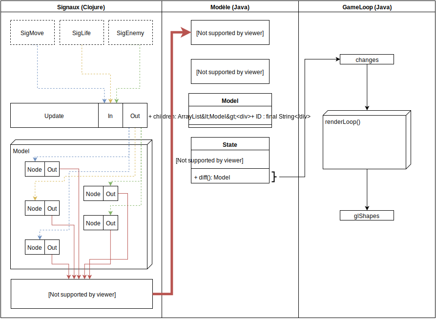

% PSTL -- FRP et voyage dans le temps
% Guillaume Hivert, Jordi Bertran de Balanda
% 25 Mai 2016

\newpage

# Introduction

Ce rapport présente le travail effectué pour l'UE projet PSTL (4I508), réalisé
sous la direction de Frédéric Peschanski.

## Sujet original

Le titre du sujet de départ du projet était "FRP et voyage dans le temps". Ce
projet avait pour but d'explorer l'approche de programmation Functional Reactive
Programming. Au fil du déroulement du projet, nous avons été amenés à
privilégier certains aspects du projet au profit d'autres.

Pour rappel, les tâches du projet étaient les suivantes:

* L'intégration de signaux de premier ordre, avec les combinateurs adéquats pour
fournir à l'utilisateur un large panel de possibilités quant à la description
des comportements
* La construction d'un modèle basé sur des structures immutables
* Les mises à jour construisant les vues à partir du modèle, gérées de façon à
émuler l'approche d'ELM et de React.

## Outils utilisés

* Clojure
* Leiningen
* Boot
* Cider
* GLFW
* LWJGL
* PNGDecoder
* Eclipse/Emacs/Atom
* Slack
* GitHub: <https://github.com/jbertran/embla>

# Ambitions

## Functional Reactive Programming

Le terme Functional Reactive Programming (FRP ci-après) décrit un paradigme de
programmation qui a pour intention d'offrir une manière déclarative de créer
des systèmes réactifs. Lorsqu'on parle de systèmes réactifs dans ce cadre, on
vise plus particulièrement les interfaces utilisateur graphiques (GUI)
représentant une scène évoluant en fonction d'entrées provenant du monde
extérieur.

Il est important de noter l'aspect __déclaratif__ du modèle offert par le
paradigme FRP dont ELM, l'exemple sur lequel se base notre approche, fait
partie. Bien que les frameworks pour GUI usuels soient déclaratifs dans le sens
général, la définition d'un nouvel élément à afficher à l'écran nécéssite que
soient décrites de manière liées la façon dont l'élément interagit avec le reste
de la scène et

## Gestion du modèle

## Live Coding

## Abstraction graphique

# Problèmes rencontrés <A RENOMMER>

## Signaux & Callback Hell

## Gestion du modèle

# Embla

<Blabla EMbla :)>

## Vue d'ensemble

### Architecture

Notre application se divise en trois parties distinctes.

* Du côté Clojure, la définition des macros offrant à l'utilisateur d'interagir
avec le modèle
* Du côté Java:
  * La définition du modèle structuré, qui est pour nous un arbre de formes
  (rectangles, triangles, sprites...)
  * Le pendant OpenGL du modèle, sous la forme d'un dictionnaire identifiant
  Embla / instance de classe forme OpenGL, qui ne sert qu'à retenir les
  identifiants nécessaires pour redessiner les formes géométriques à partir des
  données déjà présentes sur la carte graphique.

#### Signaux

#### Modèle

#### Vue


### Exécution




### OpenGL - fonctionnement

Le fonctionnement d'OpenGL est comparable à celui d'une machine à états. Pour
interagir avec des données spécifiques sur la carte graphique, il faut mettre
la machine à états OpenGL dans l'état correspondant. En particulier, en ce
qui concerne l'optimisation des transferts CPU/GPU, il est nécessaire de
lier les buffers de flottants correspondant à nos données à la machine OpenGL
avant de réaliser les opérations de dessin. Ceci nécéssite de conserver les
identifiants.

Le dessin d'une forme simple se déroule comme ceci sur OpenGL:

```java
// Lier le shader program à la machine
GL20.glUseProgram(shader_progid);
// Lier l'ID du VAO enregistrant les buffers de la forme
GL30.glBindVertexArray(vao_shapeid);
// Lier l'ID du buffer positions à la machine
GL20.glEnableVertexAttribArray(0);
GL11.glDrawArrays(GL11.GL_TRIANGLE_FAN, 0, summit_count);
GL20.glDisableVertexAttribArray(0);
// Lier l'ID du buffer couleur à la machine
GL20.glEnableVertexAttribArray(1);
GL11.glDrawArrays(GL11.GL_COLOR_ARRAY, 0, 1);
GL20.glDisableVertexAttribArray(1);
// Délier le VAO de la machine
GL30.glBindVertexArray(0);
// Délier le shader program de la machine
GL20.glUseProgram(0);
```

### Gestion des formes

Nos formes OpenGL servent donc uniquement à identifier les buffers présents
sur la carte graphique, et à s'y référer pour chaque demande de rendu. Les
objets implémentant l'interface IGLShape contiennent quatre opérations capitales
pour la gestion des formes:

* `<position/color>ToVBO` traduisent:
	* les coordonnées 2D (x, y) sur la projection vue par l'utilisateur (dont
	nous discutons plus haut) <TODO: Projection stuff> en coordonnées flottantes
	à 4 dimensions sur la projection gérée par la machine OpenGL.
	* les couleurs fournies par le modèle (concrètement de type java.AWT) en
	flottants représentant les 4 composantes d'une couleur RGBA.
* `bind<Color/Coordinates>` permettent de fournir à OpenGL un nouveau
buffer position ou couleur, modifier en place les buffers de la carte graphique,
et ainsi modifier la couleur ou la position de la forme.
* `toProjection` propose un accès après construction de l'objet à la
logique de calcul des buffers qui doivent être transférés dans la carte
graphique (notamment position et couleur). Cette opération est nécessaire pour
obtenir la modification en place de ces buffers, au lieu d'en recréer de toutes
pièces.
* `propagate` réalise l'appel à toProjection correspondant aux arguments
de la classe concrète implémentant IGLShape, de manière à reconstruire les
buffers adéquats sur la carte graphique à partir des informations véhiculées par
le noeud du modèle passé en argument.

### Boucle de rendu

Comme décrit dans la partie <TODO: numéroter>, la boucle de rendu d'OpenGL
est implémentée dans notre classe GameEngine. OpenGL requiert intrinsèquement
de redessiner la scène à chaque tour de boucle, ce qui fait que notre approche
pour minimiser les transferts vers la carte graphique est de vérifier quels
objets ont changé dans la scène, et ne modifier que ceux-ci sur la carte
graphique.

Son mode de fonctionnement est de vérifier la présence de changements fournis
après le parcours du modèle par les signaux, et répercuter ces modifications sur
les buffers de la carte graphique. On peut ensuite afficher la scène
correctement, en parcourant l'arbre du modèle. Le rendu au fil du parcours de
l'arbre nous permet de garantir automatiquement les superpositions des formes en
fonction de la profondeur des formes.

On vérifie au passage si notre liste d' objets OpenGL concorde avec notre arbre
de formes du modèle, ce qui nous permet d'éviter les comportements indéfinis
causés par une éventuelle modification directe du modèle par l'utilisateur, en
dehors du cadre du DSL qui lui est fourni.

```java
// Propagate model changes to GL buffers
if (changes.isPresent()) {
	for (Model modelch : changes.get()) {
		GLShape s = glShapes.get(modelch.ID);
		if (s != null)
			s.propagate(modelch);
 		else
			throw new RuntimeException(
				"Attempted to propagate changes to GLShape unknown to the engine");
		}
}
// Redraw the scene
draw_model_item(world);
```

La variable globale qui contient les changements de l'ancien modèle au nouveau
est mise à jour de manière asynchrone par les parcours du modèle suite à la
réception d'un signal. Cette variable fait également office de 'file d'attente'.
En effet, si plusieurs signaux causent des modifications du modèle, et que ces
modifications ne sont pas propagées dans la partie OpenGL du modèle avant
l'arrivée d'un autre signal, le remplacement simple causerait un décalage
entre la vue et le modèle jusqu'à la propagation réussie des modifications pour
le noeud de modèle concerné.

# Extensions

# Bibliographie

1. Un grand merci à tous les anonymes de StackOverflow -
<http://stackoverflow.com/>
2. Brave Clojure - <http://www.braveclojure.com/clojure-for-the-brave-and-true/>
3. ClojureDoc - <https://clojuredocs.org/>
4. Modern OpenGL, Anton Gerdelan - <http://antongerdelan.net/opengl/>
5. LWJGL wiki - <http://wiki.lwjgl.org/wiki/Main_Page>
6. Documentation LWJGL - <http://javadoc.lwjgl.org/>
7. Documentation GLFW - <http://www.glfw.org/docs/latest/>
8. Code source de React - <https://github.com/facebook/react>
9. Elm: Concurrent FRP for Functional GUIs, Evan Czaplicki -
<http://elm-lang.org/papers/concurrent-frp.pdf>
